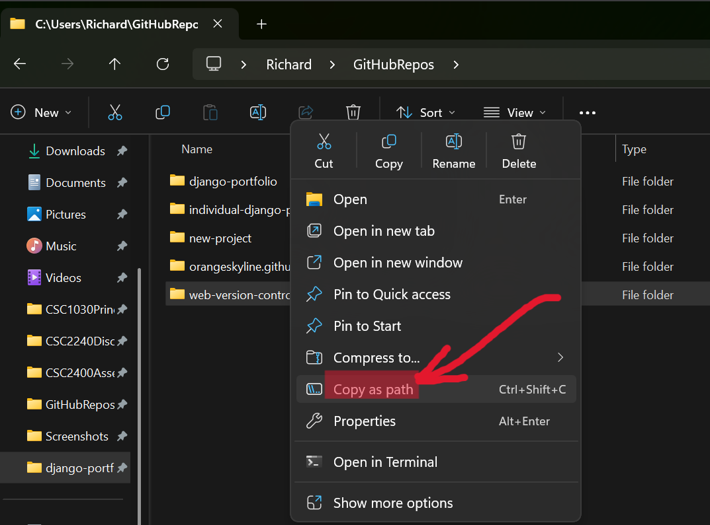
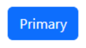
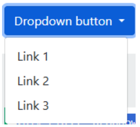

<ul id="navbar" class="horizontal">
  <li><a href="https://github.com/OrangeSkyline/orangeskyline.github.io" target="_blank" rel="noopener noreferrer">View On GitHub</a></li>
  <li><a href="https://orangeskyline.github.io" target="_blank" rel="noopener noreferrer">View On Page</a></li>
</ul>

### Welcome!

This is the start of our Documentation Page! We are [Aaron](https://github.com/Zoidster), [Alex](https://github.com/OrangeSkyline), [Admir](https://github.com/admirsmajic0), [Arieana](https://github.com/atrevizo), [Kingston](https://github.com/KafoolsDelDoe), [Nick](https://github.com/Nicobotic1), and [Richard](https://github.com/richard-RRL)!

---

# Table of Contents:

1. <a href="#markdown-cheat-sheet">Markdown Cheat Sheet(Alex)</a>
2. <a href="#command-line">Command Line(Richard)</a>
3. <a href="#python-cheat-sheet-comparisons">Python Cheat Sheet Comparisons(Kingston)</a>
   - [C++(Aaron)](#CPlusPlus)
   - [C#(Alex)](#CSharp)
   - [Java(Kingston)](#Java)
4. <a href="#django-overview">Django Overview &amp; (Nick)</a>
5. <a href="#setting-up-django">Setting Up Django &amp; (Nick)</a>
6. <a href="#gitgithub-development-environment">Git/GitHub Development Environment(Alex)</a>
7. <a href="#html">HTML(Admir)</a>
8. <a href="#accessibility">Accessibility(Kingston)</a>
9. <a href="#css-w-bootstrap">CSS w/ Bootstrap(Aaron)</a>
10. <a href="#python-virtual-environments">Python Virtual Environment(Arieana)</a>
11. <a href="#python-packages--dependencies">Python Packages &amp; Dependencies(Alex)</a>

# Markdown Cheat Sheet:

<p><strong>Section by Alexander Cranford</strong></p>

- # Bigger Heading = `# Bigger Heading`
- ## Smaller Heading = `## Smaller Heading` (These can go as small as heading 6, which is 6 #'s)
- **Bold** = `**Bold**`
- _Italic_ = `*Italic*`
- [Hyperlink](https://example.com/) = `[Hyperlink](https://example.com/)`
-  = ``
- `Code` = \`Code` OR
  \```
  Code
  \```
- - Thing 1 = `- Thing 1`
- 1. Thing 1 = `1. Thing 1`
- > Words = `> Blockquote`
- `--- Horizontal Line`

---

   <table>
      <thead>
        <tr>
          <th>Name</th>
          <th>Age</th>
        </tr>
      </thead>
      <tbody>
        <tr>
          <td>John</td>
          <td>30</td>
        </tr>
        <tr>
          <td>Jane</td>
          <td>25</td>
        </tr>
      </tbody>
   </table>

   <h3>Table = (Make sure to separate the lines above and below the table by one blank line)</h3>

```
| Name | Age |
|------|-----|
| John | 30  |
| Jane | 25  |
```

# Command Line:

Section by Richard Luna

### Definitions

Command line is a direct function that allows a user to directly control an application with the operating system.
Command Line Shells: These are distinct programs that have pre-made scripts.
Ex. Powershell, Command Prompt, Git CMD
Scripts/Commands: These are automated instructions.
Automate repetitive tasks like committing changes to github or opening a repository to work out of.
These directly communicate with CPUs which is more efficient.

### Example Commands

The following commands include standard GitHub repository commiting/pushing and setting up our Django project with a python virtual machine.
Make sure you have compatible up to date versions of both Python and Django.

  <table>
      <thead>
        <tr>
          <th>Command</th>
          <th>Example</th>
          <th>Description</th>
        </tr>
      </thead>
      <tbody>
        <tr>
          <td>Path to directory</td>
          <td><code>"C:\Users\Richa\Downloads"</code></td>
          <td>
          How to find your directory path
          You can also "copy address" from your file explorer's top bar that shows the current path</td>
        </tr>
        <tr>
          <td>cd “path to directory”</td>
          <td><code>cd "C:\Users\Richa\Downloads"</code></td>
          <td>This opens command line to that specific folder for further commands</td>
        </tr>
        <tr>
          <td>git commit -m "Your message"</td>
          <td><code>git commit -m "This is my latest update."</code></td>
          <td>Allows you to select what folder you are saving to with a note describing the save straight to the GitHub repository</td>
        </tr>
        <tr>
          <td>git push origin "branch-name"</td>
          <td><code>git push origin main .</code></td>
          <td>This pushes the save to the online repository for web access to the repository/backup</td>
        </tr>
        <tr>
          <td>py …</td>
          <td><code>py --version</code></td>
          <td>This performs a command referring to the current version of python installed on the computer.
          ie. This command will bring up the current version of python.</td>
        </tr>
        <tr>
          <td>git …</td>
          <td><code>git init</code></td>
          <td>Git performs a command using the current version of git installed to the machine.
          ie. This command initializes the current folder with the necessary files for a local Git repository.</td>
        </tr>
      </tbody>
   </table>
   
# Python Cheat Sheet Comparisons:
1. <p id="CPlusPlus"><strong>C++</strong></p>

### Variables and Declaration

#### Python

```
age = 25          # Automatically created as an integer
salary = 50000.5  # Automatically created as a float
```

Variables in Python are declared implicitly via specifying the variable name and giving a value, with the type inference.

#### C++

```
int age = 25;             // Explicitly declared as an integer
double salary = 50000.5;  // Explicitly declared as a floating-point
```

Variables in C++ are declared via specifying the type for the variable, the variable name, then an =, then the value for that variable.

### Headers/Comments

#### Python

```
# This is a python comment
```

Comments in Python can be made using the # symbol

#### C++

```
// This is a C++ comment
```

Comments in C++ can be made using two slashes in the manner of // for a single line and /\* for multiple lines.

### Libraries

#### Python

```
# main.py
# Standard library module providing access to system-specific functions and variables
import sys

# Custom local module (math_utils.py) containing mathematical helper functions
import math_utils
```

Libraries in Python are accessed using the `import` keyword followed by the library name. They are also refered to as modules

#### C++

```
// main.cpp
#include <iostream>      // Standard library header for input/output streams
#include "math_utils.h"  // Custom header file wrapped in quotes
```

Libraries in C++ can be accessed via what is called a header file. This is done by using a # sign, then the keyword `include` followed by

(If the header is a standard C++ header) the header name in <> brackets
Ex: `#include <iostream>`

(If the header name is a user made file) the name of the header file and its path relative to the directory being executed from
Ex: `#include "path/to/my_header.h"`

### Functions

#### Python

```
def add(x, y):
    return x + y
```

Functions in python can be defined via the `def` keyword then followed by the function name with its arguments given in () with their type if needed followed by a :
Brackets are not required and function bodies are determined via spacing

#### C++

```
int add(int x, int y) {
    return x + y;
}
```

Functions in C++ can be defined via specifying a return type, or void for no return type, then a name for the function followed by its arguments given in () with their type if needed then {} disclose the body of the function

### Loops

#### Python

```
# For loop: Iterates over a sequence (0 to 4)
for i in range(5):
    print(i)

# While loop: Runs as long as a condition is true
count = 0
while count < 5:
    print(count)
    count += 1
```

Loops in python include the for loop and the while loop

##### For loop:

Defined via the keywords `for i in range`, then () with the first argument is the lowest count and the second argument is the highest count. The highest count will decrement to the lowest over the course of the loop automatically

##### While loop:

Defined via the keyword `while`, then () with the first argument is the lowest count and the second argument is the highest count. The user has to choose how to decrement the counter within the loop body. Then it is ended with a : and the body is indicated via spacing

#### C++

```
// For loop: Initializes, checks condition, and increments
for (int i = 0; i < 5; i++) {
    std::cout << i << "\n";
}

// While loop: Runs as long as the condition is true
int count = 0;
while (count < 5) {
    std::cout << count << "\n";
    count++;
}
```

Loops in C++ include the for loop, the while loop, and the do-while loop

##### For loop:

Defined via the keyword `for`, then in () separated by ; the variable that will be the counter, the condition for when it should exit the loop, then the means of change on the counter, then {} disclose the body of the loop

##### While loop:

Defined via the keyword `while`, then in () a counter/condition is given that is typically modified within the body of the loop, once satisfied the loop terminates

##### Do-While loop:

Defined via the keyword `do` then {} for the body of the loop which usually contains a way to modify the loop counter, then a while keyword, then in () a counter/condition that terminates the loop once satisfied. This allows the loop to execute once even if the condition is satisfied.

### Classes

#### Python

```
class Car:
    # The constructor runs automatically whenever a new Car object is created.
    # "self" refers to the specific Car object being created.
    # "brand: str" and "year: int" are type hints telling us what kind
    # of values we expect to receive.
    def __init__(self, brand: str, year: int):

        # Store the brand inside this particular Car object.
        # "self.brand" is an instance variable, meaning every Car object
        # gets its own separate brand value.
        self.brand = brand

        # The double underscore makes this attribute "private-like."
        # Python uses name mangling here, so it is not intended to be
        # accessed directly outside of the class.
        self.__year = year

    # A method is a function that belongs to a class.
    # "self" allows this method to access data belonging to the object
    # that called it.
    def display_info(self):

        # Access the object's brand and year and display them.
        # The f-string lets us insert variable values directly into the text.
        print(f"Car: {self.brand}, Year: {self.__year}")


# Create a new Car object.
# "Toyota" is passed to the "brand" parameter.
# 2024 is passed to the "year" parameter.
my_car = Car("Toyota", 2024)

# Call the display_info() method belonging to our Car object.
# This prints the information stored inside "my_car."
my_car.display_info()
```

Classes in python are defined via the `class` keyword, then a class name, then a : and then the class body is disclosed via spacing. A constructor for the class can be defined as a function `def __init__(self`,

#### C++

```
#include <iostream>  // Provides std::cout and std::endl for displaying output.
#include <string>    // Provides the std::string data type.

class Car {
private:
    // This variable stores the year of the car.
    // "private" means code outside of the Car class cannot directly
    // access this variable.
    int year;

public:
    // This variable stores the brand of the car.
    // "public" means code outside of the class CAN directly access it.
    std::string brand;

    // Constructor:
    // This function automatically runs when a new Car object is created.
    //
    // "b" receives the car's brand.
    // "y" receives the car's year.
    //
    // The constructor then stores those values in the object's
    // "brand" and "year" variables.
    Car(std::string b, int y) {
        brand = b;
        year = y;
    }

    // Method:
    // A function that belongs to the Car class.
    //
    // This method accesses the object's stored data and prints it.
    void display_info() {
        std::cout << "Car: " << brand
                  << ", Year: " << year
                  << std::endl;
    }
};  // The semicolon after the class definition is required in C++.


int main() {

    // Create a Car object named "my_car."
    //
    // "Toyota" is passed to the constructor's "b" parameter.
    // 2024 is passed to the constructor's "y" parameter.
    //
    // The constructor then stores those values inside my_car.
    Car my_car("Toyota", 2024);

    // Call the display_info() method belonging to my_car.
    // This prints the car's stored brand and year.
    my_car.display_info();

    // Return 0 tells the operating system that the program
    // finished successfully.
    return 0;
}
```

Classes in C++ are defined via the `class` keyword, then a class name, then, within () are arguments to the class with their variable type, then {} denote the body of the class. Then within the body both member variables and member functions can be defined within its public and private tags which disclose which members can be accessed via instantiation of the class. The class can be instantiated as with any other variable type and arguments can be passed in accordance with the classes valid constructors.

---

2. <p id="CSharp"><strong>C#</strong></p>

3. <p id="Java"><strong>Java</strong></p>
---
# JavaScript To Python Cheat Sheet
Section by Kingston Bautista

Here is where to find the comparasins for Java and Python
# Variables and Declaration

### Python
Variables in Python are declared implicitly by specifying the variable name and assigning a value. Python automatically determines the variable's type.

### Python: Example

```
name = "John"
age = 25
pi = 3.14
```

### JavaScript

Variables in JavaScript are declared using the keywords let, const, or var, followed by the variable name and an optional value.

### JavaScript Example

```
JavaScript
let name = "John";
const pi = 3.14;
var age = 25;
```
Note!
- let can be reassigned.
- const cannot be reassigned after assignment.
- var is older syntax and is generally avoided in modern JavaScript.

# Headers / Comments

### Python
Comments in Python are created using the # symbol.

### Python Example

```
# This is a comment

Multi-line comments are often done using triple quotes.
Python
"""
This is a
multi-line comment
"""
```

### JavaScript

Comments in JavaScript are created using // for a single line and /* */ for multiple lines.

### JavaScript Example 

```
// Single-line comment
 
/*
Multi-line
comment
*/
```
# Libraries

### Python

Libraries in Python are accessed using the import keyword followed by the library name.

- Python
- im port math
- import random

You can also import specific functions.

### Python Example

```
from math import sqrt
``
```

### JavaScript

Libraries in JavaScript are typically accessed using the import statement.

### JavaScript Examlpe

```
import fs from "fs";
import path from "path";
```

Or specific functions can be imported.

### JavaScript Example

```
import { readFile } from "fs";
```

In older Node.js code, the require() function may be used.

### JavaScript Example

```
const fs = require("fs");
```

# Functions

### Python

Functions in Python are defined using the def keyword, followed by the function name and parameters in parentheses. A colon (:) begins the function body, which is determined through indentation.

### Python Example

```
def greet(name):
print("Hello", name)
```

Functions may return values using return.

### Python Example

```
def add(a, b):
return a + b
```

### JavaScript

Functions in JavaScript can be defined using the function keyword or arrow function syntax.

Traditional Function:

### JavaScript Example

```
function greet(name) {
console.log("Hello " + name);
}
```

Function with Return Value:

### JavaScript Example

```
function add(a, b) {
return a + b;
}
```

Arrow Function:

### JavaScript Example

```
const add = (a, b) => {
return a + b;
};
```

# Loops

### Python
Loops in Python include the for loop and the while loop.

### For Loop

Defined using the for keyword along with range().

### Python Example

```
for i in range(0, 5):
print(i)

Output:
Plain Text
0
1
2
3
4
```

### While Loop

Defined using the while keyword. The user must update the loop variable manually.

### Python Example

```
count = 0
 
while count < 5:
print(count)
count += 1
```

### JavaScript

Loops in JavaScript include the for, while, and do...while loops.

### For Loop

Defined using the for keyword with initialization, condition, and update sections separated by semicolons.

### JavaScript Example 

```
for (let i = 0; i < 5; i++) {
console.log(i);
}
```

### While Loop

Defined using the while keyword and a condition.

### JavaScript Examlpe 

```
let count = 0;
 
while (count < 5) {
console.log(count);
count++;
}
```

### Do-While Loop

Defined using the do keyword followed by a while condition. The loop runs at least once.

## JavaScript Example

```
let count = 0;
 
do {
console.log(count);
count++;
} while (count < 5);
```

# Classes

### Python

Classes in Python are defined using the class keyword followed by a class name and a colon. The body is determined through indentation.

A constructor is defined using the __init__() function.
### Python Examlpe 

```
class Student:
 
def __init__(self, name):
self.name = name
 
def greet(self):
print("Hello", self.name)

Instantiating a class:
```

### PythonExample 

```
student = Student("Alice")
student.greet()
```

### JavaScript

Classes in JavaScript are defined using the class keyword followed by a class name. Constructors and methods are placed inside braces {}.

### JavaScript Example

```
class Student {
 
constructor(name) {
this.name = name;
}

greet() {
console.log("Hello " + this.name);
}
}
Instantiating a class:
```

### JavaScript Example

```
const student = new Student("Alice");
student.greet();
```

Properties and methods are typically accessed using the dot (.) operator.

# Quick Python → JavaScript Translation Reference

<table>
      <thead>
        <tr>
          <th>JavaScript</th>
          <th>Python</th>
        </tr>
      </thead>
      <tbody>
        <tr>
          <td>x = 5</td>
          <td>let x = 5;</td>
        </tr>
        <tr>
          <td>name = "Bob"</td>
          <td>let name = "Bob";</td>
        </tr>
         <tr>
          <td>print(x)</td>
          <td>console.log(x);</td>
        </tr>
         <tr>
          <td>input()</td>
          <td>prompt()</td>
        </tr>
        <tr>
          <td>def func():</td>
          <td>function func () {}</td>
        </tr>
        <tr>
          <td>True</td>
          <td>true</td>
        </tr>
        <tr>
          <td>False</td>
          <td>false</td>
        </tr>
        <tr>
          <td>and</td>
          <td>&&</td>
        </tr>
        <tr>
          <td>or</td>
          <td>`</td>
        </tr>
        <tr>
          <td>not</td>
          <td>!</td>
        </tr>
        <tr>
          <td>len(list)</td>
          <td>array.length</td>
        </tr>
        <tr>
          <td>for i in range(5)</td>
          <td>for(let i = 0; i < 5; i++)</td>
        </tr>
        <tr>
          <td>class Example:</td>
          <td>class Example {}</td>
        </tr>
      </tbody>
   </table>

---

# Django Overview:

Section by Nick Larsen

### What is Django?

Django is a Python framework that we can use to help us build web applications. Django does a lot of the heavy lifting in creating the backends of web applications. This allows us to focus our attention on design and process.

### Why would want to use Django?

- Django can help build secure and scalable websites quickly.

- Django does a lot of the heavy lifting for the backend of a website / web application.

- Django is free.

- Django is open source.

- Django uses python.

### What are some websites that were built using Django?

1. Instagram

2. Spotify

3. The Washington Post

# Setting up Django

Section by Nick Larsen

# Git/GitHub Development Environment:

# HTML:


# Accessibility:

### Web Accessibility Cheat Sheet (Do & Don’t)

Designing Inclusive Websites section by Kingston Bautista

# Use Semantic (HTML)

Semantic elements help screen readers understand page structure.

### Don’t

```
<div class="header">My Website</div>
<div class="nav">Menu</div>
<div class="content">Page Content</div>
```

### Do

```
<header>My Website</header>
 
<nav>
#homeHome</a>
#aboutAbout</a>
</nav>
 
<main>
<h1>Page Content</h1>
</main>
```

### Why?
- Improves screen reader navigation
- Gives meaning to page sections
- Improves accessibility and SEO

# Add Alternative Text to Images (HTML)

Screen readers read image descriptions aloud.

### Don’t 

```
dog.jpg
```

### Do

```
dog.jpg
```

# Decorative Images (HTML)

```
border.png
```

### Why?
- Helps users who cannot see images
- Provides context and meaning

# Create Accessible Links (HTML)

Links should clearly describe their destination.

### Don’t

```
guide.htmlClick Here</a>
```

### Do

```
guide.html
Read the Accessibility Guide
</a>
```

### Why?
- Screen readers often list links separately
- Users know where the link goes

# Use Proper Heading Structure (HTML)

Headings create a page outline.

### Do

```
<h1>Accessibility Guide</h1>
 
<h2>Images</h2>
 
<h3>Alt Text</h3>
 
<h2>Forms</h2>
```

### Don’t

```
<h1>Main Topic</h1>
<h4>Subtopic</h4>
```

### Why?
- Helps users navigate quickly
- Creates a logical reading order

# Ensure Sufficient Color Contrast (CSS)

Text must be easy to see.

### Don’t

```
color: lightgray;
background: white;
```

### Do

```
color: #222222;
background: #ffffff;
```

### Why?
- Improves readability
- Helps users with low vision

# Never Use Color Alone (HTML)

Provide another indicator besides color.

### Don’t

```
<p style="color:red">
Required field
</p>
```

### Do

```
<p style="color:red">
* Required field
</p>
```

###Why?
- Helps color-blind users
- Makes meaning clear to everyone

# Label Form Inputs (HTML)

Every form field should have a label.

### Don’t

```
<input type="email"
placeholder="Email Address">
```

### Do

```
<label for="email">
Email Address
</label>

<input type="email"
id="email">
```

### Why?
- Screen readers identify form fields correctly
- Easier for all users

# Support Keyboard Navigation (HTML)

Users should be able to use the site without a mouse.

### Do

```
<button>Submit</button>
 
contact.html
Contact Us
</a>
```

### Don’t

```
<div onclick="submitForm()">
Submit
</div>
```

### Why?
- Many users rely on keyboards
- Supports assistive technology

# Provide Captions and Transcripts (HTML)

Videos should include captions.

### Do

```
<video controls>
lesson.mp4
captions.vtt
</video>
```

### Why?
- Helps deaf and hard-of-hearing users
- Improves understanding

# Use ARIA When Needed

Accessible Rich Internet Applications (ARIA) add information for assistive technologies.

### Example (HTML)

```
<button aria-label="Close Menu">
X
</button>
```

Example (HTML)

```
<input
aria-required="true">
```

### Why?
- Provides additional meaning
 Helps screen readers interpret custom components

# Make Error Messages Clear (HTML)

Tell users what went wrong and how to fix it.

### Do

```
<p class="error">
Email address is required.
</p>
```

### Why?
- Reduces confusion
- Improves form usability

# Responsive and Flexible Design (CSS)

Users may zoom in or use different devices.

### Do

```
body {
font-size: 1rem;
}
 
.container {
width: 100%;
}
```

### Why?
- Supports mobile devices
- Helps users with low vision
--- 
# CSS w/ Bootstrap:

## What is it?

### CSS

CSS is a language used for the stylization of webpages on top of base HTML. It can be applied across multiple pages using a style sheet. A style sheet is a pre-defined CSS file that defines declarations that can be used on the different selected elements in HTML to change aspects like their alignment, color, font, size, and many other aesthetic aspects.

### BOOTSTRAP

Bootstrap is a large collection of pre-written CSS and JavaScript that allows for the quick application of styling, layouts, and interactive components to webpages like buttons.

## Setup

### CSS


`<link rel="stylesheet" href="style.css">`

CSS can be defined in a .css file as a style sheet. To link CSS it is done with the above `<link>` tag with the href attribute telling where to find the CSS file, The document holds different declarations about how the HTML elements in question should be styled via a selector which represents the element, then a key value pair that defines the specifics of the change being undertaken. CSS can be defined in a separate file or written in-document with the HTML.

### BOOTSTRAP

`<div class="container mt-5">
    <div class="row">
        <div class="col-sm-4">`

`<link href="BOOTSTRAP_CSS_URL" rel="stylesheet">`

## Containers/Grid (BOOTSTRAP)

### Containers

Containers are used to pad the content inside of them. Fluid containers are a responsive design element that adjust to screen width across devices and platforms. Containers can be colored, bordered, buffered, styled, and change the aesthetics of their text

### Grid


The grid system allows for even spacing of elements across the span of a page for the organization of information and content
To link BOOSTRAP, it is done with the above `<link>` tag with the href attribute pointing to the bootstrap version in use. Once done classes from BOOTSTRAP can be used via inserting `<div>` tags and instantiating the classes within them such that they apply to the children.

## Responsive Design (BOOTSTRAP)

Responsive design is a design methodology that accounts for the differences in layout and size of webpages across different devices. This is a major element of bootstraps design philosophy.

## Navigation/Components (BOOTSTRAP)

### Nav Menus

```
<ul class="nav">
  <li class="nav-item">
	<a class="nav-link" href="#">Link</a>
  </li>
  <li class="nav-item">
	<a class="nav-link" href="#">Link</a>
  </li>
  <li class="nav-item">
	<a class="nav-link" href="#">Link</a>
  </li>
  <li class="nav-item">
	<a class="nav-link disabled" href="#">Disabled</a>
  </li>
</ul>
```


Simple menus that allow for direct navigation can be made in the form of menus and bars.

### Buttons

`<button type="button" class="btn btn-primary">Primary</button>`



Buttons are singlet components on the page that can link to content on other pages or the same page

### Drop Downs

```
<div class="dropdown">
  <button type="button" class="btn btn-primary dropdown-toggle" data-bs-toggle="dropdown">
	Dropdown button
  </button>
  <ul class="dropdown-menu">
	<li><a class="dropdown-item" href="#">Link 1</a></li>
	<li><a class="dropdown-item" href="#">Link 2</a></li>
	<li><a class="dropdown-item" href="#">Link 3</a></li>
  </ul>
</div>
```



Drop down are components that when clicked provide multiple selectable options that navigate the page(s)

### Carousel

```
<div id="demo" class="carousel slide" data-bs-ride="carousel">

  <!-- Indicators/dots -->
  <div class="carousel-indicators">
	<button type="button" data-bs-target="#demo" data-bs-slide-to="0" class="active"></button>
	<button type="button" data-bs-target="#demo" data-bs-slide-to="1"></button>
	<button type="button" data-bs-target="#demo" data-bs-slide-to="2"></button>
  </div>

  <!-- The slideshow/carousel -->
  <div class="carousel-inner">
	<div class="carousel-item active">
  	
	</div>
	<div class="carousel-item">
  	
	</div>
	<div class="carousel-item">
  	
	</div>
  </div>

  <!-- Left and right controls/icons -->
  <button class="carousel-control-prev" type="button" data-bs-target="#demo" data-bs-slide="prev">
	<span class="carousel-control-prev-icon"></span>
  </button>
  <button class="carousel-control-next" type="button" data-bs-target="#demo" data-bs-slide="next">
	<span class="carousel-control-next-icon"></span>
  </button>
</div>
```


A rotating collection of images and content on the page that can be navigated.

##### .carousel

Creates a carousel

##### .carousel-indicators

Adds indicators for the carousel.

##### .carousel-inner

Adds slides to the carousel

##### .carousel-item

Specifies the content of each slide

##### .carousel-control-prev

Adds a left button to the carousel

##### .carousel-control-next

Adds a right button to the carousel

##### .carousel-control-prev-icon

Used together with .carousel-control-prev to create a "previous" button

##### .carousel-control-next-icon

Used together with .carousel-control-next to create a "next" button

##### .slide

Adds a CSS transition and animation effect when sliding from one item to the next.

## Accessibility

Bootstrap includes built-in accessibility features to help make websites usable for people with disabilities. Use semantic HTML, proper labels, and Bootstraps accessibility classes and attributes where needed.

# Python Virtual Environments:

# Python Packages & Dependencies:
