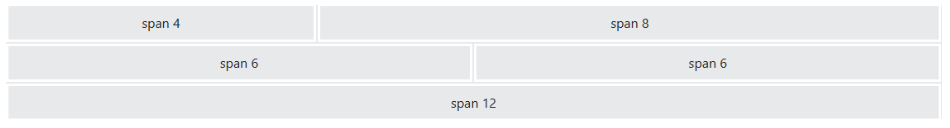
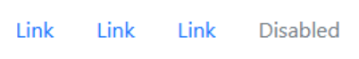

### Welcome!
This is the start of our Documentation Page! We are [Aaron](https://github.com/Zoidster), [Alex](https://github.com/OrangeSkyline), [Admir](https://github.com/admirsmajic0), [Arieana](https://github.com/atrevizo), [Kingston](https://github.com/KafoolsDelDoe), [Nick](https://github.com/Nicobotic1), and [Richard](https://github.com/richard-RRL)!
If you'd like, click this link to view the website version of this documentation: [Documentation Page](https://orangeskyline.github.io)

---
# Table of Contents:
1. <a href="#markdown-cheat-sheet">Markdown Cheat Sheet(Alex)</a>
2. <a href="#command-line">Command Line(Richard)</a>
3. <a href="#python-cheat-sheet-comparisons">Python Cheat Sheet Comparisons(Kingston)</a>
   - [C++(Aaron)](#CPlusPlus)
   - [C#(Alex)](#CSharp)
   - [Java(Kingston)](#Java)
4. <a href="#django-overview">Django Overview &amp; (Nick)</a>
5. <a href="#setting-up-django">Setting Up Django &amp; (Nick)</a>
6. <a href="#gitgithub-development-environment">Git/GitHub Development Environment(Alex)</a>
7. <a href="#html">HTML(Admir)</a>
8. <a href="#accessibility">Accessibility(Kingston)</a>
9. <a href="#css-w-bootstrap">CSS w/ Bootstrap(Aaron)</a>
10. <a href="#python-virtual-environments">Python Virtual Environment(Arieana)</a>
11. <a href="#python-packages--dependencies">Python Packages &amp; Dependencies(Alex)</a>

# Markdown Cheat Sheet:
- # Bigger Heading =  `# Bigger Heading`
- ## Smaller Heading =  `## Smaller Heading` (These can go as small as heading 6, which is 6 #'s)
- **Bold** =  `**Bold**`
- *Italic* =  `*Italic*` 
- [Hyperlink](https://example.com/) =  `[Hyperlink](https://example.com/)`
-  = ``
- `Code` =  \`Code` OR 
  \```
   Code
  \```
- - Thing 1 =  `- Thing 1`
- 1. Thing 1 =  `1. Thing 1`
- > Words = `> Blockquote`
- `--- Horizontal Line`

---

   <table>
      <thead>
        <tr>
          <th>Name</th>
          <th>Age</th>
        </tr>
      </thead>
      <tbody>
        <tr>
          <td>John</td>
          <td>30</td>
        </tr>
        <tr>
          <td>Jane</td>
          <td>25</td>
        </tr>
      </tbody>
   </table>

   <h3>Table = (Make sure to separate the lines above and below the table by one blank line)</h3>

   ```
   | Name | Age |
   |------|-----|
   | John | 30  |
   | Jane | 25  |
   ```

# Command Line:

# Python Cheat Sheet Comparisons:
1. <p id="CPlusPlus"><strong>C++</strong></p>

2. <p id="CSharp"><strong>C#</strong></p>

3. <p id="Java"><strong>Java</strong></p>

# Django Overview:

Section by Nick Larsen

### What is Django?

Django is a Python framework that we can use to help us build web applications. Django does a lot of the heavy lifting in creating the backends of web applications. This allows us to focus our attention on design and process.

### Why would want to use Django?

- Django can help build secure and scalable websites quickly.

- Django does a lot of the heavy lifting for the backend of a website / web application.

- Django is free.

- Django is open source.

- Django uses python.

### What are some websites that were built using Django?

1. Instagram 

2. Spotify

3. The Washington Post

# Setting up Django

Section by Nick Larsen

# Git/GitHub Development Environment:

# HTML:

# Accessibility:

# CSS w/ Bootstrap:
## What is it?

### CSS
CSS is a language used for the stylization of webpages on top of base HTML. It can be applied across multiple pages using a style sheet. A style sheet is a pre-defined CSS file that defines declarations that can be used on the different selected elements in HTML to change aspects like their alignment, color, font, size, and many other aesthetic aspects.
### BOOTSTRAP
Bootstrap is a large collection of pre-written CSS and JavaScript that allows for the quick application of styling, layouts, and interactive components to webpages like buttons. 

## Setup

### CSS


`<link rel="stylesheet" href="style.css">`

CSS can be defined in a .css file as a style sheet. To link CSS it is done with the above `<link>` tag with the href attribute telling where to find the CSS file, The document holds different declarations about how the HTML elements in question should be styled via a selector which represents the element, then a key value pair that defines the specifics of the change being undertaken. CSS can be defined in a separate file or written in-document with the HTML. 
### BOOTSTRAP

`<div class="container mt-5">
    <div class="row">
        <div class="col-sm-4">`

`<link href="BOOTSTRAP_CSS_URL" rel="stylesheet">`

## Containers/Grid (BOOTSTRAP)

### Containers
Containers are used to pad the content inside of them. Fluid containers are a responsive design element that adjust to screen width across devices and platforms. Containers can be colored, bordered, buffered, styled, and change the aesthetics of their text
### Grid



The grid system allows for even spacing of elements across the span of a page for the organization of information and content
To link BOOSTRAP, it is done with the above `<link>` tag with the href attribute pointing to the bootstrap version in use. Once done classes from BOOTSTRAP can be used via inserting `<div>` tags and instantiating the classes within them such that they apply to the children. 
## Responsive Design (BOOTSTRAP)
Responsive design is a design methodology that accounts for the differences in layout and size of webpages across different devices. This is a major element of bootstraps design philosophy. 
## Navigation/Components (BOOTSTRAP)

### Nav Menus
```<ul class="nav">
  <li class="nav-item">
	<a class="nav-link" href="#">Link</a>
  </li>
  <li class="nav-item">
	<a class="nav-link" href="#">Link</a>
  </li>
  <li class="nav-item">
	<a class="nav-link" href="#">Link</a>
  </li>
  <li class="nav-item">
	<a class="nav-link disabled" href="#">Disabled</a>
  </li>
</ul>
```
Simple menus that allow for direct navigation can be made in the form of menus and bars.



### Carousel

```
<div id="demo" class="carousel slide" data-bs-ride="carousel">

  <!-- Indicators/dots -->
  <div class="carousel-indicators">
	<button type="button" data-bs-target="#demo" data-bs-slide-to="0" class="active"></button>
	<button type="button" data-bs-target="#demo" data-bs-slide-to="1"></button>
	<button type="button" data-bs-target="#demo" data-bs-slide-to="2"></button>
  </div>

  <!-- The slideshow/carousel -->
  <div class="carousel-inner">
	<div class="carousel-item active">
  	
	</div>
	<div class="carousel-item">
  	
	</div>
	<div class="carousel-item">
  	
	</div>
  </div>

  <!-- Left and right controls/icons -->
  <button class="carousel-control-prev" type="button" data-bs-target="#demo" data-bs-slide="prev">
	<span class="carousel-control-prev-icon"></span>
  </button>
  <button class="carousel-control-next" type="button" data-bs-target="#demo" data-bs-slide="next">
	<span class="carousel-control-next-icon"></span>
  </button>
</div
```


A rotating collection of images and content on the page that can be navigated.

##### .carousel
Creates a carousel
##### .carousel-indicators
Adds indicators for the carousel.
##### .carousel-inner
Adds slides to the carousel
##### .carousel-item
Specifies the content of each slide
##### .carousel-control-prev
Adds a left button to the carousel
##### .carousel-control-next
Adds a right button to the carousel
##### .carousel-control-prev-icon
Used together with .carousel-control-prev to create a "previous" button
##### .carousel-control-next-icon
Used together with .carousel-control-next to create a "next" button
##### .slide
Adds a CSS transition and animation effect when sliding from one item to the next. 


# Python Virtual Environments:

# Python Packages & Dependencies:
